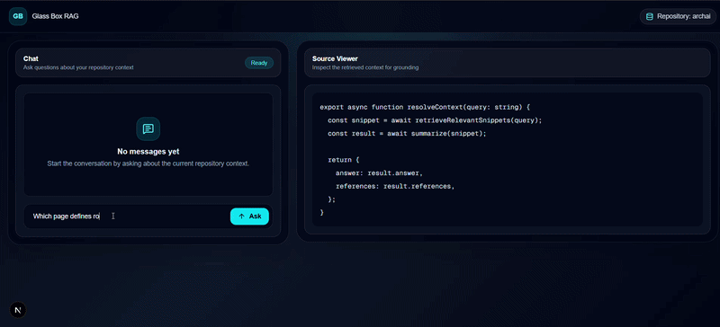

# Glass Box RAG

> A Retrieval-Augmented Generation (RAG) system that answers questions about any code repository with transparent source citations and an interactive source viewer.

<p align="center">
  
</p>

<p align="center">
  <strong>Upload a repository → Index the code → Ask questions → Inspect the exact source lines used to generate the answer.</strong>
</p>

---

## Overview

Glass Box RAG is a code-aware Retrieval-Augmented Generation system that allows developers to interact with a codebase using natural language.

Instead of generating answers without evidence, the application retrieves relevant code snippets from an indexed repository, sends them as context to a Large Language Model (Groq Llama 3.3 70B), and displays both the generated response and the exact source code responsible for that answer.

This creates an explainable AI experience where every response is grounded in the actual repository.

---

## Features

- Repository indexing using ChromaDB
- Local embedding generation with Hugging Face
- Semantic code search
- Retrieval-Augmented Generation (RAG)
- Streaming responses using Groq
- Automatic source citations
- Interactive Source Viewer
- Line-level highlighting
- Modern split-screen interface
- Next.js App Router architecture

---


## Tech Stack

### Frontend

- Next.js 16
- React
- TypeScript
- Tailwind CSS

### Backend

- Next.js Route Handlers
- Groq SDK
- ChromaDB

### AI

- Groq
- Llama-3.3-70b-versatile
- Hugging Face Embeddings

### Vector Database

- ChromaDB

---

# Project Architecture
# 🏗️ System Architecture

```mermaid
flowchart LR

A[User] --> B[Chat Interface<br/>Next.js + React]

B --> C["POST /api/chat"]

C --> D["queryRepository()"]

D --> E[Generate Query Embedding]

E --> F[(ChromaDB)]

F --> G[Top 5 Relevant Code Chunks]

G --> H[buildRagPrompt()]

H --> I[Groq Llama 3.3 70B]

I --> J[Streaming Response]

J --> B

B --> K[Parse Citation Tags]

K --> L["POST /api/source"]

L --> M[Read Source File]

M --> N[Source Viewer]

N --> O[Highlight Referenced Lines]
```

```text
                     User
                      │
                      ▼
             Chat Interface (React)
                      │
                      ▼
             POST /api/chat
                      │
                      ▼
            queryRepository()
                      │
                      ▼
                ChromaDB Search
                      │
       Top 5 Relevant Code Chunks
                      │
                      ▼
             Prompt Builder
                      │
                      ▼
           Groq Llama 3.3 70B
                      │
          Streaming Response
                      │
                      ▼
              Chat Interface
                      │
                      ▼
          Citation Click Event
                      │
                      ▼
             Source Viewer API
                      │
                      ▼
      Highlighted Source Code
```

---

# Repository Structure

```text
glass-box-rag-project
│
├── app
│   ├── api
│   │   ├── chat
│   │   └── source
│   │
│   ├── globals.css
│   ├── layout.tsx
│   └── page.tsx
│
├── components
│   ├── ChatPanel.tsx
│   ├── SourceViewer.tsx
│   └── TopBar.tsx
│
├── lib
│   ├── chroma.ts
│   ├── embeddings.ts
│   ├── prompt.ts
│   ├── repository.ts
│   └── source.ts
│
├── scripts
│   ├── ingest.ts
│   └── test-query.ts
│
├── repo
│     └── (Indexed Repository)
│
├── assets
│     demo.gif
│
├── .env.example
├── package.json
└── README.md
```

---

# How It Works

### Step 1

The repository is scanned recursively.

↓

### Step 2

Files are divided into semantic chunks.

↓

### Step 3

Embeddings are generated using Hugging Face.

↓

### Step 4

Embeddings are stored inside ChromaDB.

↓

### Step 5

The user asks a question.

↓

### Step 6

Semantic search retrieves the most relevant code chunks.

↓

### Step 7

The retrieved code is combined with the user's question.

↓

### Step 8

Groq generates a grounded response.

↓

### Step 9

Citation tags are attached to the response.

↓

### Step 10

Clicking a citation opens the Source Viewer and highlights the exact lines used.

---

# Citation Format

Every answer includes citations in the following format:

```text
[[file:path/to/file.tsx:10-25]]
```

Example:

```text
Authentication is handled inside the login function.

[[file:components/login.tsx:42-70]]
```

These citations are interactive and open the Source Viewer.

---

# Running the Project

## 1. Clone

```bash
git clone https://github.com/Fathimafidhatp/glass-box-rag-project.git
cd glass-box-rag-project
```

---

## 2. Install

```bash
npm install
```

---

## 3. Create Environment Variables

Create a file named

```text
.env.local
```

Example:

```env
HF_TOKEN=your_huggingface_token
GROQ_API_KEY=your_groq_api_key

CHROMA_HOST=localhost
CHROMA_PORT=8000
```

---

## 4. Start ChromaDB

```bash
docker run -d --name chromadb -p 8000:8000 chromadb/chroma
```

If the container already exists:

```bash
docker start chromadb
```

Verify:

```bash
curl http://localhost:8000/api/v2/heartbeat
```

---

## 5. Index a Repository

Place the repository you want to analyze inside:

```text
repo/
```

Then run:

```bash
npm run ingest
```

---

## 6. Start the Application

```bash
npm run dev
```

Open

```
http://localhost:3000
```

---

# Example Questions

- How does authentication work?
- Where is the architecture report generated?
- Explain the application routing.
- Which component renders the report page?
- How are streaming responses implemented?
- Where is the Groq API called?
- Explain the RAG pipeline.
- Which files interact with ChromaDB?
- How is the prompt constructed?
- How are citations generated?

---

## License

This project is licensed under the MIT License.
